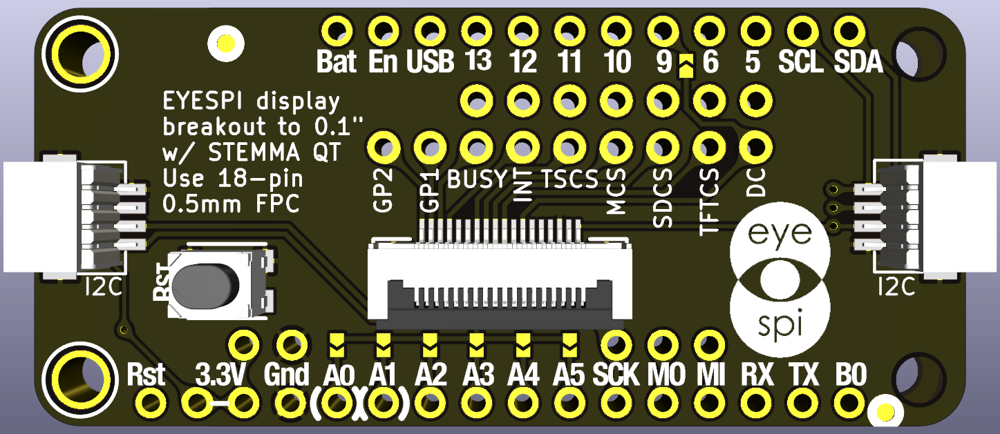
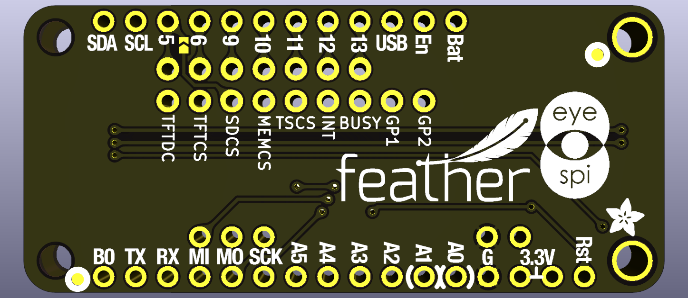

# eyeSPI-FeatherWing-PCB
Adafruit compatible FeatherWing for EyeSPI with STEMMA QT I2C

This is PCB was designed in KiCAD 6.10 and is based upon [Adafruit's](https://www.adafruit.com/) [Adafruit Feather STM32F405 Express PCB](https://github.com/adafruit/Adafruit-Feather-STM32F405-Express-PCB) for the general layout and [Adafruit EYESPI Breakout Board PCB](https://github.com/adafruit/Adafruit-EYESPI-PCB) for the FPC connector.  I have included 2x JST SH4 connectors on the board for STEMMA QT I2C at each end of the board.  I've included an oval Reset button since it is likely this board will be on top covering the Feather's reset button.  The different Chip Select lines can be jumpered to any of the digital pins as desired.  I have a couple of solder pads in place to set the TFT's DC line to D9, the TFT's SD Card slot's CS to D5 (on the back of the board) and then just do a solder bridge of the TFT's CS line to D6.  I have a project that uses D10 for Networking so I need that one free.  I'm using through holes for the CS, etc. lines here so you can jumper on either the front or back of the board.  I've also laid out some solder pads to allow you to use anyone of the Analog 0-5 pins and tie it to the backlight or use them for soldering jumper wires to.

This project was developed because [Adafruit](https://www.adafruit.com/) has not designed such a FeatherWing yet.  I tried to design this in a fashion of what I would hope [Adafruit](https://www.adafruit.com/) would design themselves.
